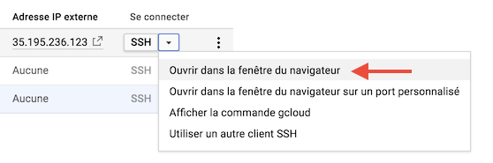

# Run Galaxy training course

This doc should be soon available as a [ReadTheDocs web site](https://artbio.github.io/Run-Galaxy/)

### Google Cloud Engine
1. Prerequisite: a Google account / Gmail account
2. Connect to [Google Cloud Engine](https://cloud.google.com/)
3. Click on `Essai Gratuit` / `Free Trial`
4. Enter your Gmail mail address and password
5. Review conditions and accept
6. Inscription Form:
  - `Entreprise` / `Company` : put anything like "Perso" or "foo/bar"
  - `Ajouter une carte de paiement` / `Add credit Card` or optionally `Ajouter un compte bancaire` / `Bank account`
7. You are in for a free trial of 12 months / 300 $
8. go to your [Google Cloud Console](https://console.cloud.google.com/home/dashboard) to control your spin off / control your Virtual Machines

### Spin off a virtual Machine
1. Go to the Google Cloud Dashboard and select "Compute Engine" on the left hand menu bar
2. Select the submenu "Instances de VM"

3. Click on the top bar menu the "CREER UNE INSTANCE" panel
4. Put name "bare-galaxy"
5. Choose a Zone (suggestion: `europe-west1-c`)
6. Type de machine: choose 2 vCPU with 7.5 Memory
7. Disque de Démarrage: Click on `Modifier`
  - Select `Ubuntu 14.04 LTS`
  - At the bottom of the form, put 100 Go for the Disk Size (Taille)
  - Leave the selection `Disque persistant standard` / `Standard persistant drive`
  - Click `Select` / `Sélectionner`
8. Click `Authorize HTTP traffic` / `Autoriser le traffic HTTP`
9. Click `Créer` / `Create`

### Connect to the started virtual Machine
After a few seconds, the VM turns on "green" and an `ssh` menu becomes selectable

10. Roll down this `ssh` menu and select the first option `Ouvrir dans la fenêtre du navigateur`

11. A shell console pop out and you should now be ready to control your VM with linux command lines

12. Try to enter the drosofff@bare-galaxy:~$ `sudo -i` command and hit the return key.
13. The unix prompt become `root@bare-galaxy:~# `, you are mastering your VM as root administrator !
14. [Optional] Here, if you do not have to work with the VM, you can turn off the VM and even trash it:
  - in one shot, go back to your VM control panel in the web browser, ensure that the running VM is checked, and press the Trash button in the top menu.
  - Confirm that you want to trash the VM and loose everything.
  - after a few seconds the VM disappears from the Dashboard.
