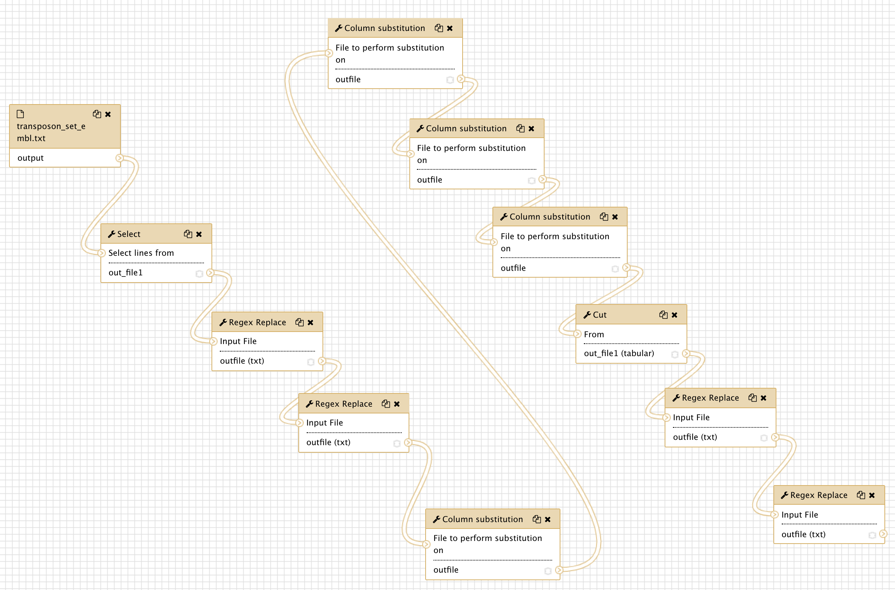

# Running a workflow in Galaxy

Whether you deployed Galaxy using git, ansible or docker (next section), you are now administrating your
own Galaxy server !

In this use case, we are going to 

- Upload a workflow description file in the Galaxy server instance
- Visualise this workflow and see that tools to execute the workflow are missing
- Install these missing tools
- Eventually run the workflow on input data obtained from a remote public repository.

#### Upload a workflow description file

- Ensure you are connected to your Galaxy server as an admin (admin@galaxy.org`:`admin)
- Click the workflow menu
- Click the "Upload or import workflow" button at the top right
- In the `Galaxy workflow URL:` field, paste the url of the workflow file:

`https://raw.githubusercontent.com/ARTbio/Run-Galaxy/master/workflows/Galaxy-Workflow-canonical_transposons.gtf_from_transposon_sequence_set.txt.ga`

Note that this file is in the [Run-Galaxy](https://github.com/ARTbio/Run-Galaxy) repository where all the material for this training
is hosted

- alternatively, you could download the [Galaxy-Workflow-canonical_transposons.gtf_from_transposon_sequence_set.txt.ga](https://raw.githubusercontent.com/ARTbio/Run-Galaxy/master/workflows/Galaxy-Workflow-canonical_transposons.gtf_from_transposon_sequence_set.txt.ga)
locally on your computer, and click the `Galaxy workflow file:` button instead of `Galaxy workflow URL:`

- Click on the `Import` button

- Observe the numerous warning returned by the galaxy server when it imported the workflow file.

This looks like
```
Imported, but some steps in this workflow have validation errors. Workflow canonical_transposons.gtf from transposon_sequence_set.txt (imported from uploaded file) imported successfully. The workflow requires the following tools that are not available in this Galaxy instance.You can likely install the required tools from one of the Galaxy tool sheds listed below.
Tool name toolshed.g2.bx.psu.edu/repos/kellrott/regex_replace/regex_replace/1.0.0, id toolshed.g2.bx.psu.edu/repos/kellrott/regex_replace/regex_replace/1.0.0, version 1.0.0
Tool name toolshed.g2.bx.psu.edu/repos/kellrott/regex_replace/regex_replace/1.0.0, id toolshed.g2.bx.psu.edu/repos/kellrott/regex_replace/regex_replace/1.0.0, version 1.0.0
Tool name toolshed.g2.bx.psu.edu/repos/jjohnson/regex_find_replace/regexColumn1/0.1.0, id toolshed.g2.bx.psu.edu/repos/jjohnson/regex_find_replace/regexColumn1/0.1.0, version 0.1.0
Tool name toolshed.g2.bx.psu.edu/repos/jjohnson/regex_find_replace/regexColumn1/0.1.0, id toolshed.g2.bx.psu.edu/repos/jjohnson/regex_find_replace/regexColumn1/0.1.0, version 0.1.0
Tool name toolshed.g2.bx.psu.edu/repos/jjohnson/regex_find_replace/regexColumn1/0.1.0, id toolshed.g2.bx.psu.edu/repos/jjohnson/regex_find_replace/regexColumn1/0.1.0, version 0.1.0
Tool name toolshed.g2.bx.psu.edu/repos/jjohnson/regex_find_replace/regexColumn1/0.1.0, id toolshed.g2.bx.psu.edu/repos/jjohnson/regex_find_replace/regexColumn1/0.1.0, version 0.1.0
Tool name toolshed.g2.bx.psu.edu/repos/bgruening/text_processing/tp_cut_tool/1.1.0, id toolshed.g2.bx.psu.edu/repos/bgruening/text_processing/tp_cut_tool/1.1.0, version 1.1.0
Tool name toolshed.g2.bx.psu.edu/repos/kellrott/regex_replace/regex_replace/1.0.0, id toolshed.g2.bx.psu.edu/repos/kellrott/regex_replace/regex_replace/1.0.0, version 1.0.0
Tool name toolshed.g2.bx.psu.edu/repos/kellrott/regex_replace/regex_replace/1.0.0, id toolshed.g2.bx.psu.edu/repos/kellrott/regex_replace/regex_replace/1.0.0, version 1.0.0

&lt;a href=&#34;https://toolshed.g2.bx.psu.edu/repository/find_tools?galaxy_url=http://35.187.179.31/&amp;tool_id=toolshed.g2.bx.psu.edu/repos/kellrott/regex_replace/regex_replace/1.0.0,toolshed.g2.bx.psu.edu/repos/kellrott/regex_replace/regex_replace/1.0.0,toolshed.g2.bx.psu.edu/repos/jjohnson/regex_find_replace/regexColumn1/0.1.0,toolshed.g2.bx.psu.edu/repos/jjohnson/regex_find_replace/regexColumn1/0.1.0,toolshed.g2.bx.psu.edu/repos/jjohnson/regex_find_replace/regexColumn1/0.1.0,toolshed.g2.bx.psu.edu/repos/jjohnson/regex_find_replace/regexColumn1/0.1.0,toolshed.g2.bx.psu.edu/repos/bgruening/text_processing/tp_cut_tool/1.1.0,toolshed.g2.bx.psu.edu/repos/kellrott/regex_replace/regex_replace/1.0.0,toolshed.g2.bx.psu.edu/repos/kellrott/regex_replace/regex_replace/1.0.0,&#34;&gt;Galaxy Main Tool Shed&lt;/a&gt;
&lt;a href=&#34;https://testtoolshed.g2.bx.psu.edu/repository/find_tools?galaxy_url=http://35.187.179.31/&amp;tool_id=toolshed.g2.bx.psu.edu/repos/kellrott/regex_replace/regex_replace/1.0.0,toolshed.g2.bx.psu.edu/repos/kellrott/regex_replace/regex_replace/1.0.0,toolshed.g2.bx.psu.edu/repos/jjohnson/regex_find_replace/regexColumn1/0.1.0,toolshed.g2.bx.psu.edu/repos/jjohnson/regex_find_replace/regexColumn1/0.1.0,toolshed.g2.bx.psu.edu/repos/jjohnson/regex_find_replace/regexColumn1/0.1.0,toolshed.g2.bx.psu.edu/repos/jjohnson/regex_find_replace/regexColumn1/0.1.0,toolshed.g2.bx.psu.edu/repos/bgruening/text_processing/tp_cut_tool/1.1.0,toolshed.g2.bx.psu.edu/repos/kellrott/regex_replace/regex_replace/1.0.0,toolshed.g2.bx.psu.edu/repos/kellrott/regex_replace/regex_replace/1.0.0,&#34;&gt;Galaxy Test Tool Shed&lt;/a&gt;
```
in a red scary window


When you read the warnings, you will see that the workflow was indeed successfully imported.
However, some tools are missing, namely:
```
toolshed.g2.bx.psu.edu/repos/kellrott/regex_replace/regex_replace/1.0.0, version 1.0.0
toolshed.g2.bx.psu.edu/repos/jjohnson/regex_find_replace/regexColumn1/0.1.0, version 0.1.0
toolshed.g2.bx.psu.edu/repos/bgruening/text_processing/tp_cut_tool/1.1.0, version 1.1.0
```

The other lines are redundant, because the workflow is using the same tools at different steps.

- So far, so good, the missing tools are reported in the [To_be_installed.md](https://github.com/ARTbio/Run-Galaxy/blob/master/workflows/To_be_installed.md)
file in the Run-Galaxy repository (or just above in a more complex format)

- Now, click on the workflow menu.

You should see the imported workflow in the list:


- Click the workflow and select the `Edit` option
- Dismiss the warnings (You are already aware of it) by clicking the `Continue` button
- See again in the editor window, all the missing steps in red. At this stage you can't
even see anymore the paths between the various workflow steps !
- Click the upper "wheel" icon and select `Close`, we will come back to this when the missing tools are installed in the Server !

#### Installing missing tools

So, we have to install our first three tools in our Galaxy instance:

    - regex_find_replace
    
      owner: jjohnson
    
      versions: 0.1.0
      
    - regex_replace
    
      owner: kellrott
    
      versions: 	1.0.0
      
    - text_processing
    
      owner: bgruening
    
      versions: 1.1.0

- Click on the `Admin` top menu
- On the left bar click on `Manage installed tools`

You'll see a single lonely tool `yac_clipper`, which you probably already used
to remove adapter sequences for small-RNA-seq data.

- Now, click the `Search Tool Shed` menu (again in the left bar)
- Press the `Galaxy Main Tool Shed` button
- In the search field, copy and paste `regex_find_replace`, and press the `enter` key.
- Two tools will show up with exactly the same name.
    We want the tool owned by `jjohnson`, so we'll click this one, and select `preview and install` (No other solution anyway)
- Click the `Install to Galaxy` button at the top of the screen
- In the `Select existing tool panel section:` menu, select `Text Manipulation`.
Thus, the tools will appears in the section `Text Manipulation` of the Galaxy tools.
- Click `Install`
- You are going to wait for ~20 sec or so, before seeing the `Monitor installing tools...` screen.
- Rapidly enough, the Installation status should turn out green. Sometimes, things do not go well.
If the installation fails, just call the `Repository Actions - repair repository` menu
(maybe a good idea to call me too...)
- Click again the `Manage installed tools` menu in the left bar, and look at the newly
installed tool `regex_find_replace` in the list.


- Repeat the same operations for the tool `regex_replace` owned by `kellrott` (version `1.0.0`)

- Repeat the same operations for the tool `text_processing` owned by `bgruening`(version `1.1.0`)
   For this last installation, you will see a different panel after clicking `Install to Galaxy`:
   If you scroll down a little bit, you should see a list of uninstalled tool dependencies like this:
   
   
   These are software packages required to get the tool `text_processing` working properly.
   The required packages will be installed by the lately adopted package manager `conda.
   You can further check this by clicking the `Display Details` button bellow the Dependency list.
   
   At this stage, avoid further distraction and do not forget to select tool panel section
   `Text Manipulation`, and finally click the `Install` button.
   This time, the `Monitor installing tool shed repositories` will display new steps (in yellow),
   including the `Installing tool dependencies` step. The whole process should take longer,
   about 2 min and 30 secondes (a bit too short for a coffee through).
- Finally go back a last time to the `Manage installed tools` panel:
    
    
    
    
    There you see the yac_clipper tool with its three new tool friends... Those tools needed
    to properly run the imported workflow.
    
#### Check that the imported workflow now display correctly

If you click the `workflow` top menu, you should now be able to edit the imported workflow,
and see that everything is displaying correctly:



We can go through the various steps of the workflow and figure out what it is doing.

This workflow actually performs a suite of find-and-replace text manipulations, starting
from input data that has been tagged `transposon_set_embl.txt` and producing a new text
dataset that is renamed `canonical_transposons.gtf`.

We will come back to all these steps after the workflow execution. However, we need to
retrieve the input data set before running the workflow on these data.

#### Retrieve the `transposon_set_embl.txt` dataset

- Create a new history and name it `transposon_set_embl.txt manipulation`
- import the dataset using the `Paste/Fetch data` mode of the upload manager (the small
bottom-top arrow icone at the top left of the Galaxy interface). Copy the URL
`https://github.com/cbergman/transposons/raw/master/current/transposon_sequence_set.embl.txt`
in the open field and click the `Start` button.
- have a close look at the file

#### Run the workflow

- Click on the workflow menu
- Click on the workflow and select the Run option
- Leave the `Send results to a new history` menu to the `No` option for the moment.
- Just Click the `Run workflow` button to run the workflow, and look at datasets in the
history turning from grey to yellow to green. Note: often you don't see the dataset in the
"yellow" state (running). You just need to refresh the history with the 2-curved-arrows
icon of the local history menu.

#### Discussion on workflows
    
    
    


