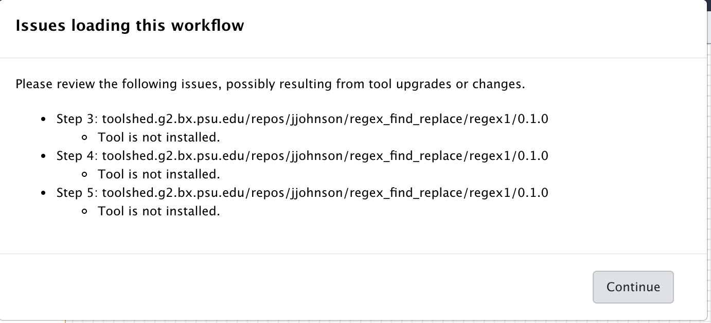

## Running a workflow in Galaxy

Whether you deployed Galaxy using ansible or docker, you have are now administrating your
own Galaxy server !

In this use case, we are going to 

- Upload a workflow description file in the Galaxy server instance
- Visualise this workflow and see that tools to execute the workflow are missing
- Install these missing tools
- Eventually run the workflow on input data obtained from a remote public repository.

#### Upload a workflow description file

- Ensure you are connected to your Galaxy server as an admin (admin@galaxy.org`:`admin)
- Click the workflow menu
- Click the "Upload or import workflow" button at the top right
- In the `Galaxy workflow URL:` field, paste the url of the workflow file:

`https://raw.githubusercontent.com/ARTbio/Run-Galaxy/master/workflows/Galaxy-Workflow-canonical_transposons.gtf_from_transposon_sequence_set.txt.ga`

Note that this file is in the [Run-Galaxy](https://github.com/ARTbio/Run-Galaxy) repository where all the material for this training
is hosted

- alternatively, you could download the [Galaxy-Workflow-canonical_transposons.gtf_from_transposon_sequence_set.txt.ga](https://raw.githubusercontent.com/ARTbio/Run-Galaxy/master/workflows/Galaxy-Workflow-canonical_transposons.gtf_from_transposon_sequence_set.txt.ga)
locally on your computer, and click the `Galaxy workflow file:` button instead of `Galaxy workflow URL:`

- Click on the `Import` button

- Observe the numerous warning returned by the galaxy server when it imported the workflow file.

This looks like
```
Imported, but some steps in this workflow have validation errors. Workflow canonical_transposons.gtf from transposon_sequence_set.txt (imported from uploaded file) imported successfully. The workflow requires the following tools that are not available in this Galaxy instance.You can likely install the required tools from one of the Galaxy tool sheds listed below.
Tool name toolshed.g2.bx.psu.edu/repos/kellrott/regex_replace/regex_replace/1.0.0, id toolshed.g2.bx.psu.edu/repos/kellrott/regex_replace/regex_replace/1.0.0, version 1.0.0
Tool name toolshed.g2.bx.psu.edu/repos/kellrott/regex_replace/regex_replace/1.0.0, id toolshed.g2.bx.psu.edu/repos/kellrott/regex_replace/regex_replace/1.0.0, version 1.0.0
Tool name toolshed.g2.bx.psu.edu/repos/jjohnson/regex_find_replace/regexColumn1/0.1.0, id toolshed.g2.bx.psu.edu/repos/jjohnson/regex_find_replace/regexColumn1/0.1.0, version 0.1.0
Tool name toolshed.g2.bx.psu.edu/repos/jjohnson/regex_find_replace/regexColumn1/0.1.0, id toolshed.g2.bx.psu.edu/repos/jjohnson/regex_find_replace/regexColumn1/0.1.0, version 0.1.0
Tool name toolshed.g2.bx.psu.edu/repos/jjohnson/regex_find_replace/regexColumn1/0.1.0, id toolshed.g2.bx.psu.edu/repos/jjohnson/regex_find_replace/regexColumn1/0.1.0, version 0.1.0
Tool name toolshed.g2.bx.psu.edu/repos/jjohnson/regex_find_replace/regexColumn1/0.1.0, id toolshed.g2.bx.psu.edu/repos/jjohnson/regex_find_replace/regexColumn1/0.1.0, version 0.1.0
Tool name toolshed.g2.bx.psu.edu/repos/bgruening/text_processing/tp_cut_tool/1.1.0, id toolshed.g2.bx.psu.edu/repos/bgruening/text_processing/tp_cut_tool/1.1.0, version 1.1.0
Tool name toolshed.g2.bx.psu.edu/repos/kellrott/regex_replace/regex_replace/1.0.0, id toolshed.g2.bx.psu.edu/repos/kellrott/regex_replace/regex_replace/1.0.0, version 1.0.0
Tool name toolshed.g2.bx.psu.edu/repos/kellrott/regex_replace/regex_replace/1.0.0, id toolshed.g2.bx.psu.edu/repos/kellrott/regex_replace/regex_replace/1.0.0, version 1.0.0

&lt;a href=&#34;https://toolshed.g2.bx.psu.edu/repository/find_tools?galaxy_url=http://35.187.179.31/&amp;tool_id=toolshed.g2.bx.psu.edu/repos/kellrott/regex_replace/regex_replace/1.0.0,toolshed.g2.bx.psu.edu/repos/kellrott/regex_replace/regex_replace/1.0.0,toolshed.g2.bx.psu.edu/repos/jjohnson/regex_find_replace/regexColumn1/0.1.0,toolshed.g2.bx.psu.edu/repos/jjohnson/regex_find_replace/regexColumn1/0.1.0,toolshed.g2.bx.psu.edu/repos/jjohnson/regex_find_replace/regexColumn1/0.1.0,toolshed.g2.bx.psu.edu/repos/jjohnson/regex_find_replace/regexColumn1/0.1.0,toolshed.g2.bx.psu.edu/repos/bgruening/text_processing/tp_cut_tool/1.1.0,toolshed.g2.bx.psu.edu/repos/kellrott/regex_replace/regex_replace/1.0.0,toolshed.g2.bx.psu.edu/repos/kellrott/regex_replace/regex_replace/1.0.0,&#34;&gt;Galaxy Main Tool Shed&lt;/a&gt;
&lt;a href=&#34;https://testtoolshed.g2.bx.psu.edu/repository/find_tools?galaxy_url=http://35.187.179.31/&amp;tool_id=toolshed.g2.bx.psu.edu/repos/kellrott/regex_replace/regex_replace/1.0.0,toolshed.g2.bx.psu.edu/repos/kellrott/regex_replace/regex_replace/1.0.0,toolshed.g2.bx.psu.edu/repos/jjohnson/regex_find_replace/regexColumn1/0.1.0,toolshed.g2.bx.psu.edu/repos/jjohnson/regex_find_replace/regexColumn1/0.1.0,toolshed.g2.bx.psu.edu/repos/jjohnson/regex_find_replace/regexColumn1/0.1.0,toolshed.g2.bx.psu.edu/repos/jjohnson/regex_find_replace/regexColumn1/0.1.0,toolshed.g2.bx.psu.edu/repos/bgruening/text_processing/tp_cut_tool/1.1.0,toolshed.g2.bx.psu.edu/repos/kellrott/regex_replace/regex_replace/1.0.0,toolshed.g2.bx.psu.edu/repos/kellrott/regex_replace/regex_replace/1.0.0,&#34;&gt;Galaxy Test Tool Shed&lt;/a&gt;
```
in a red scary window



When you read the warnings, you will see that the workflow was indeed successfully imported.
However, some tools are missing, namely:
```
toolshed.g2.bx.psu.edu/repos/kellrott/regex_replace/regex_replace/1.0.0, version 1.0.0
toolshed.g2.bx.psu.edu/repos/jjohnson/regex_find_replace/regexColumn1/0.1.0, version 0.1.0
toolshed.g2.bx.psu.edu/repos/bgruening/text_processing/tp_cut_tool/1.1.0, version 1.1.0
```

The other lines are redundant, because the workflow is using the same tools at different steps.

- So far, so good, the missing tools are reported in the [To_be_installed.md]() file in the Run-Galaxy repository
(or just above in a more complex format)

- Now, click on the workflow menu.

You should see the imported workflow in the list:


- Click the workflow and select the `Edit` option
- Dismiss the warnings (You are already aware of it) by clicking the `Continue` button
- See again in the editor window, all the missing steps in red. At this stage you can't
even see anymore the paths between the various workflow steps !
- Click the upper "wheel" icon and select `Close`, we will come back to this when the missing tools are installed in the Server !

#### Installing missing tools

So, we have to install our first three tools in our Galaxy instance:

```


